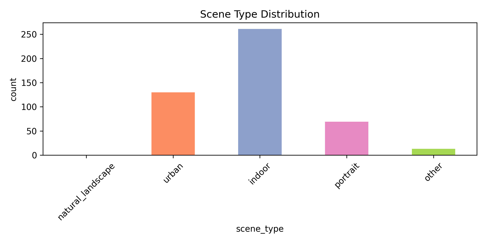
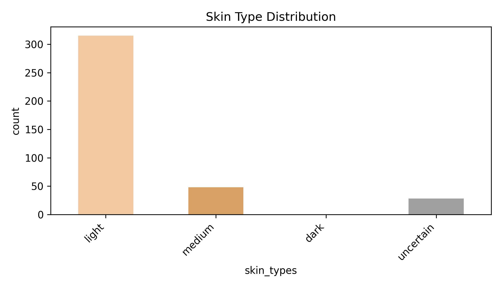

# Image Content Analysis

Run a vision-language model on your own image dataset, export structured CSV results, and optionally generate basic figures from those results.

This repository is designed as a simple research artifact:

- input: an image directory
- inference: scene attributes, visual complexity, and skin-type analysis
- output: CSV files, basic figures, and optional paper-analysis CSV exports

## Demo

Start here if you want the fastest overview:

- [DEMO.md](./DEMO.md)
- [examples/sample_outputs/cid2013](./examples/sample_outputs/cid2013)

### Visual Preview

#### Scene Distribution



#### Skin-Type Distribution



## Features

- configurable dataset path from the command line
- prompt files separated from code
- `.env`-based API key setup
- reusable inference modules under `src/`
- ready-to-run CLI scripts under `scripts/`
- curated sample outputs under `examples/sample_outputs/`

## Repository Structure

- `configs/prompts/`
  prompt files for scene, complexity, and skin-type tasks
- `src/image_content/common/`
  shared utilities for image loading, API calls, and CSV writing
- `src/image_content/inference/`
  core task implementations for scene, complexity, and skin-type inference
- `src/image_content/visualization/`
  plotting implementations
- `src/image_content/paper/`
  paper-specific analyses such as SPAQ validation, PCA, CQ, and complexity-consistency validation
- `scripts/`
  user-facing entry points
- `examples/sample_outputs/`
  small example outputs kept for GitHub display
- `result/paper_figures/`
  selected paper-facing CSV/PNG assets

## Setup

Install dependencies:

```bash
python -m pip install -r requirements.txt
```

Create a local `.env` file:

```bash
cp .env.example .env
```

On Windows PowerShell:

```powershell
Copy-Item .env.example .env
```

Then edit `.env`:

```env
DASHSCOPE_API_KEY=your_api_key_here
```

The scripts automatically read `.env` from the project root. This is the recommended setup.

## Quick Start

### 1. Run scene inference

```bash
python scripts/run_scene_inference.py --input-dir "path/to/images" --output-csv "outputs/scene_results.csv"
```

### 2. Run complexity inference

```bash
python scripts/run_complexity_inference.py --input-dir "path/to/images" --output-csv "outputs/complexity_results.csv"
```

### 3. Run skin-type inference

If you already generated scene results, you can use `--metadata-csv` to prefilter images whose `memory_color` contains `human_skin_tone`.

```bash
python scripts/run_skin_type_inference.py --input-dir "path/to/images" --metadata-csv "outputs/scene_results.csv" --output-csv "outputs/skin_type_results.csv"
```

### 4. Generate figures

```bash
python scripts/plot_scene_results.py --inputs "outputs/scene_results.csv" --dataset-names "MyDataset" --output-dir "outputs/scene_figures"
python scripts/plot_complexity_results.py --inputs "outputs/complexity_results.csv" --dataset-names "MyDataset" --output-dir "outputs/complexity_figures"
python scripts/plot_skin_type_results.py --inputs "outputs/skin_type_results.csv" --dataset-names "MyDataset" --output-dir "outputs/skin_type_figures"
```

### 5. Optional paper analyses

Run these only after you have already generated the dataset-level inference CSVs.
If your outputs were written somewhere else, copy or rename them into the filenames below before running the manuscript analyses.

For the manuscript-style analyses, the repository expects these files under `result/`:

- `result/scene_analysis_results_spaq.csv`
- `result/scene_analysis_results_koniq10k.csv`
- `result/scene_analysis_results_livewild.csv`
- `result/scene_analysis_results_cid2013.csv`
- `result/complexity_results_spaq.csv`
- `result/complexity_results_koniq10k.csv`
- `result/complexity_results_live.csv`
- `result/complexity_results_cid2013.csv`
- `Scene category labels.xlsx` for the SPAQ validation step

By default, the paper-analysis scripts export CSV/TXT only. Add `--with-plots` only if you also want figures.

```bash
python scripts/run_spaq_validation.py
python scripts/run_semantic_pca.py --input "result/scene_analysis_results_koniq10k.csv"
python scripts/run_complexity_group_consistency.py --input "result/complexity_results_cid2013.csv"
python scripts/plot_cq_cleveland.py
```

Optional plot rendering:

```bash
python scripts/run_spaq_validation.py --with-plots
python scripts/run_semantic_pca.py --input "result/scene_analysis_results_koniq10k.csv" --with-plots
python scripts/plot_cq_cleveland.py --with-plots
```

## Main Tasks

- scene attribute extraction
- visual complexity analysis
- skin-type analysis

## Key Runtime Options

All inference scripts support the same main configuration pattern:

- `--model`
- `--base-url`
- `--api-env-var`
- `--max-workers`
- `--checkpoint-csv`
- `--checkpoint-interval`
- `--timeout`
- `--temperature`
- `--prompt-file`

## Example Outputs

See the curated example output directory:

- [examples/sample_outputs/cid2013](./examples/sample_outputs/cid2013)

This is intentionally small. The repository keeps representative outputs, not every local experimental artifact.

## Paper Coverage

This repository now includes the executable code and retained figures for:

- closed-set scene attribute annotation
- visual complexity annotation
- skin-type analysis
- cross-dataset attribute plots
- SPAQ validation
- CID2013 complexity group-consistency analysis
- semantic PCA exports
- CQ complexity exports

The low-level descriptor analysis discussed in the manuscript is not yet included as an executable pipeline in this repository snapshot.

## Notes

- Input images are discovered recursively under `--input-dir`.
- Output identifiers are stored as paths relative to the input root when possible.
- If needed, you can still set `DASHSCOPE_API_KEY` manually in your shell instead of using `.env`.
